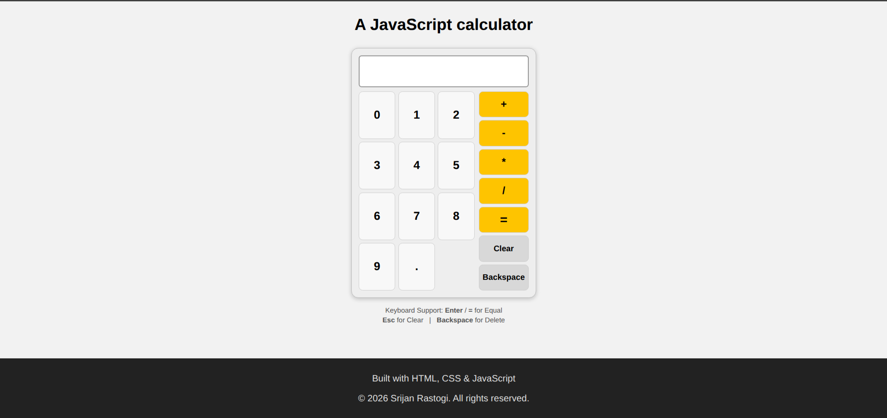

# JavaScript Calculator

A fully functional calculator built as part of [The Odin Project](https://www.theodinproject.com/) JavaScript course.

The project focuses on using JavaScript to manipulate the DOM, handle user events, manage application state, and build a functional interactive UI.

## Features

- Basic arithmetic operations:
  - Addition `+`
  - Subtraction `-`
  - Multiplication `*`
  - Division `/`
- Decimal number support
- Prevents entering multiple decimal points in the same number
- Consecutive operator handling
- Chained calculations
- Division-by-zero error handling
- Results rounded to 4 decimal places
- Clear button to reset the calculator
- Backspace button to remove the last entered character
- Prevents repeated `=` calculations
- Handles incomplete calculations safely
- Starts a new calculation when entering a number after a completed result
- Keyboard support:
  - `0–9` → Numbers
  - `.` → Decimal
  - `+`, `-`, `*`, `/` → Operators
  - `Enter` / `=` → Calculate
  - `Escape` → Clear
  - `Backspace` → Delete
- Styled calculator interface

## Built With

- HTML5
- CSS3
- JavaScript (ES6+)

## Project Structure

```text
calculator/
│
├── index.html
├── index.js
├── styles.css
├── screenshot1.png
└── README.md
```

## Screenshot



## Credits

Built by **Srijan Rastogi** as part of [The Odin Project](https://www.theodinproject.com/) JavaScript course.

## License

This project was created for educational purposes.